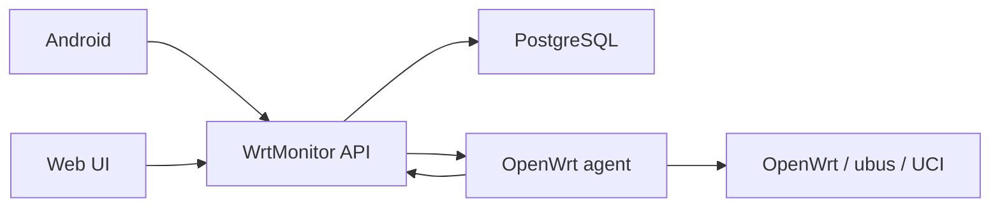

# Архитектура WrtMonitor

## Компоненты

1. Сервер `FastAPI` хранит пользователей, устройства, telemetry и очередь команд.
2. `PostgreSQL` хранит постоянные данные.
3. OpenWrt agent работает на роутере как `init.d`-сервис.
4. Android и Web UI подключаются только к серверу, а не напрямую к роутеру.

## Поток данных



## Команды

Сервер не выполняет команды на роутере напрямую. Он только ставит их в очередь, а agent забирает их при polling.

Текущий allowlist:

- `router.reboot`
- `wifi.set_enabled`
- `wifi.set_ssid`
- `wifi.set_password`
- `network.interfaces`
- `agent.disconnect`
- `agent.update`
- `agent.rollback`
- `agent.set_auto_update`

## Telemetry

Agent отправляет snapshot в:

```text
POST /api/v1/agent/telemetry
```

Последний snapshot доступен через:

```text
GET /api/v1/devices/{device_id}/telemetry/latest
```

В telemetry теперь дополнительно входит блок `agent`:

- версия agent;
- статус auto-update;
- последняя проверка обновлений;
- результат последнего обновления;
- последняя ошибка;
- backup availability;
- источник обновления.

## OpenWrt agent update pipeline

Источник обновления:

```text
/downloads/openwrt/
```

Server раздаёт:

- `wrtmonitor-agent`
- `wrtmonitor.init`
- `install-openwrt.sh`
- `agent-version.txt`
- `SHA256SUMS.txt`

Agent делает:

1. скачивание во временную директорию;
2. проверку `SHA-256`;
3. `sh -n` для shell-скриптов;
4. backup текущей версии;
5. замену файлов;
6. rollback при ошибке.

## Устройства

Устройство может быть:

- `provisioned`
- `online`
- `offline`
- `disconnecting`
- `disabled`

Удаление из списка в `rc7` сделано как soft-archive:

- удалить можно только `disabled` устройство;
- запись скрывается из обычного списка;
- telemetry и history команд остаются в базе;
- для повторного подключения агент нужно зарегистрировать заново.
